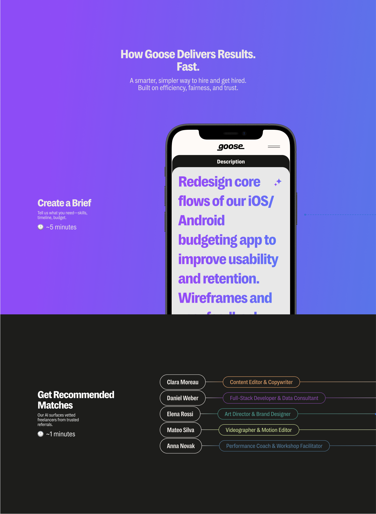

# Goose Frontend Challenge

## Goal

Recreate the visual from `static/images/prototype.png` as faithfully as you can using this SvelteKit project. Treat it like a landing‑section build: gradient background, headline/subcopy, iPhone mockup, and the dark section with recommended matches.

You can view the reference assets in this repo:

- Prototype: `static/images/prototype.png`
- iPhone image: `static/images/goose-iphone.png`

---

## Getting Started

### Prerequisites

- Node 20+ and npm 9+ installed

### Install & Run

```bash
npm install
npm run dev
```

The app starts on `http://localhost:5173` (Vite default). Use `npm run build` to build and `npm run preview` to serve a production build locally.

---

## What To Build

- **Hero section on gradient** matching the prototype layout and typography.
- **Center iPhone mockup** using `static/images/goose-iphone.png` with the on‑screen content area approximated from the prototype.
- **Dark section** beneath the gradient with the “Get Recommended Matches” copy and the five outlined “match” pills with labels and colored outlines.

Build it as a single page at the root route. You can compose it with Svelte components if you prefer, but keep the final output as one page.

---

## Design Tokens

- **Primary gradient** (required):

```css
/* Example usage */
--goose-gradient: linear-gradient(95deg, #9747FF 16.16%, #447FED 117.37%);

.bg-goose-gradient {
  background: var(--goose-gradient);
}
```

- Use the iPhone mockup in `static/images/goose-iphone.png` where shown in the prototype.

You have freedom on exact fonts as long as the overall look and visual weight closely match the prototype. Aim for clean spacing, large headline scale, rounded corners, and high‑contrast foregrounds.

---

## Constraints & Tips

- Keep dependencies minimal. Svelte + Tailwind is sufficient.
- Responsive design is super important.
- Don’t over‑engineer: clarity and readability of the code matter more than micro‑optimizations.

---

## What We Evaluate

- Visual accuracy vs. `static/images/prototype.png`.
- Clean, readable code.
- Responsiveness across multiple screens.
- Thoughtful use of the provided gradient and asset.

---

## Submission

1. Fork this repository.
2. Create a feature branch named `feat/your-name`.
3. Implement your solution.
4. Open a Pull Request against this repo with:
   - A short description of your approach and any trade‑offs.
   - At least one screenshot of your final result.

We’ll review the PR, run it locally, and leave feedback there.

---

## Reference

Preview the reference images directly in your editor or render them in Markdown:


